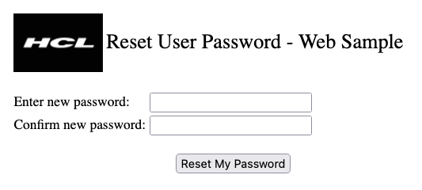

# Sample Web Agent - Reset User Password

## Info
Property | Value
---|---
Filename | PwdResetSample.nsf
Templatename | -
Template version | 8.5.1 (18.11.2008)
Signed by | Notes Template Development/Domino
Optimized for | Web

To build the application from the source see the latest on [Source Code Integration](https://help.hcltechsw.com/dom_designer/14.0.0/basic/wn_sourcecodeutilitytool.html) in Domino. See the [Releases](https://github.com/HCL-TECH-SOFTWARE/domino-pwdresetsample/releases) for the application download.

## What does this database do?

This database provides authenticated web users the ability to reset the password of their NotesID when it is stored in the IDVault. The application runs an agent to call the IDVault ResetUserPassword function of the NotesSession LotusScript object. For this to work, the agent needs to be signed with an identity that is a PasswordReset authority.

## How to use?
Refer to [this documentation](docs/index.md)

## Related information
- [Assigning password reset authority](https://help.hcltechsw.com/domino/12.0.2/admin/conf_assigningpasswordresetauthority_t.html)
- [Creating and configuring an ID vault](https://help.hcltechsw.com/domino/12.0.2/admin/conf_creatingandconfiguringanidvault_t.html)

## Related Open Source projects
- OpenNTF: [IDVault Password Reset / Xpages](https://www.openntf.org/internal/home.nsf/project.xsp?name=IDVault%20Password%20Reset)
- OpenNTF: [Password Reset Tool](https://openntf.org/main.nsf/project.xsp?r=project/Password%20Reset%20Tool)

## Issues
For issues please use the [GitHub issue tracker](https://github.com/HCL-TECH-SOFTWARE/domino-pwdresetsample/issues)

## Contributing
We welcome contributions following [our guidelines](CONTRIBUTING.md).

## License
The files in this repository are licensed under the [Apache License 2.0](https://www.apache.org/licenses/LICENSE-2.0.html).
